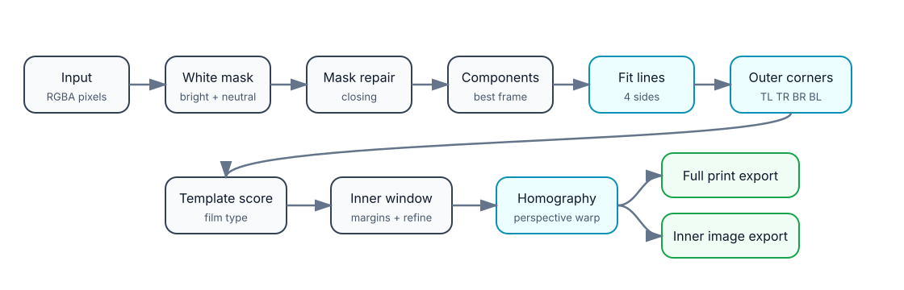
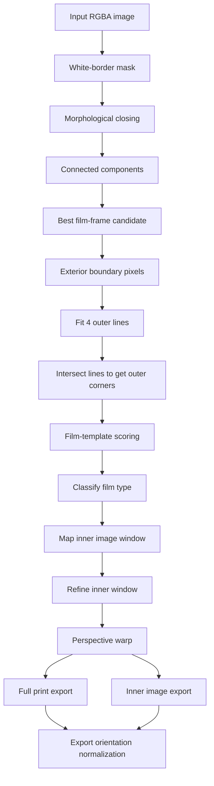
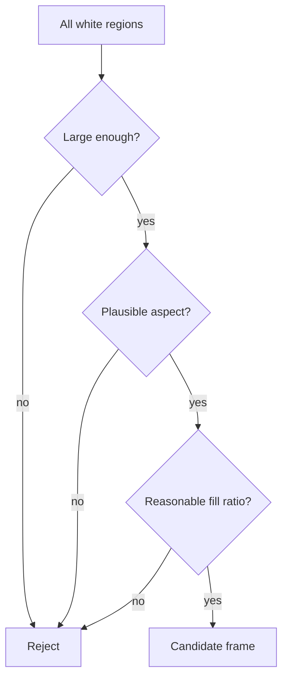
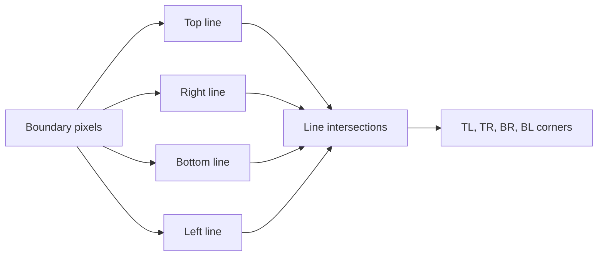

# Pipeline overview

This document explains the `instant_scan` image-processing pipeline visually and conceptually.

The goal is:

> Given a casual phone photo containing an Instax/Polaroid print, find the physical print, classify the film format, correct perspective/skew, and export both the full bordered print and the inner photo area.

## Big-picture flow





## Pipeline stages

### 1. Input

The C API accepts raw RGBA pixels:

```c
instant_result instant_scan_rgba(
    const unsigned char *rgba,
    int width,
    int height,
    int stride,
    instant_options options
);
```

The library deliberately does **not** load image files itself. This keeps it easy to use from Android, Python, desktop tools, or tests.

```text
Android Bitmap / Camera frame
        ↓
RGBA buffer
        ↓
instant_scan_rgba(...)
```

---

### 2. White-border mask

Instant-film prints usually have a bright, low-saturation border. The detector creates a binary mask:

```text
pixel = white-border candidate?
```

A pixel is treated as likely border when it is:

- bright enough
- roughly neutral / low chroma
- not strongly colorful

Conceptually:

```text
luma = weighted brightness
chroma = max(R,G,B) - min(R,G,B)

white_candidate = luma high AND chroma low
```

This is intentionally simple and dependency-free, so it can run inside a small C library.

---

### 3. Morphological closing

Users may write dates, names, or notes on the border. That creates dark gaps inside the white frame.

To tolerate this, the mask is repaired with **morphological closing**:

```text
closing(mask) = erode(dilate(mask))
```


Effect:

```text
Before:
██████  ██  ██████
      text gap

After:
██████████████████
```

The original image is not modified. Closing is only used to make detection more stable. Handwriting is still preserved in the final exported crop.

---

### 4. Connected components

After mask repair, the detector finds connected white regions.

For each component it computes:

```text
area
bounding box
width / height ratio
fill ratio
```

Then it keeps the most plausible instant-film frame.

Good candidates are:

- large enough
- roughly rectangular
- not too thin
- not the entire image background
- close to known instant-film proportions



---

### 5. Exterior boundary extraction

The selected component may contain holes from text or image content. Instead of fitting lines to every white pixel, the detector extracts only the **exterior boundary**.

This matters because border writing should not pull the edge estimate inward.

```text
Use pixels that touch the outside background.
Ignore interior holes/noise.
```

```text
+-----------------------------+
| exterior boundary pixels    |
|   date / text ignored       |
|                             |
+-----------------------------+
```

---

### 6. Line fitting

The exterior boundary is divided into four sides:

```text
top
right
bottom
left
```

Each side is fitted with a line.

A line is represented as:

```text
a x + b y + c = 0
```

The four fitted lines are then intersected to recover the four print corners.



---

### 7. Film-template scoring

Outer width/height ratio alone is useful, but not enough. Perspective distortion can make an Instax Wide print look too square in the camera image.

So the detector scores known film templates:

```text
Instax Mini
Instax Square
Instax Wide
Polaroid Classic
Polaroid Go
```

Each film template defines:

```text
outer width / height
inner image width / height
left / top / right / bottom border margins
```

These values live in:

```text
include/instant_film_dimensions.h
```

Template scoring asks:

```text
If this detected quadrilateral were this film type,
would the expected inner image window line up with actual image/border transitions?
```

The classifier uses:

- outer ratio
- inner image-window ratio
- expected border layout
- edge transitions from white border to image content

---

### 8. Inner window mapping

Once the film type is known, the library knows where the visible photo area should be inside the print.

Example for Instax Wide:

```text
outer frame: 108 × 86 mm
image area:   99 × 62 mm
margins: left 4.5, top 5, right 4.5, bottom 19 mm
```

The inner rectangle in film coordinates is:

```text
x0 = left_margin
y0 = top_margin
x1 = outer_width  - right_margin
y1 = outer_height - bottom_margin
```

Those four inner points are mapped back to the source image using the same perspective model as the outer frame.

---

### 9. Inner refinement

The template gives a good first guess, but real prints and detections are imperfect.

The refinement step locally searches around the expected inner image boundary and scores candidate rectangles using:

- stronger edge transition at the photo/border boundary
- white border just outside the rectangle
- small penalty for drifting too far from the known template

This reduces leftover white border in the inner export.


---

### 10. Perspective warp / extraction

The library can export:

```text
full print with border
inner photo only
```

Both are generated by warping a quadrilateral in the source image into a flat rectangle.

```c
int instant_extract_quad_rgba(...);
int instant_extract_rgba(...);        // full print
int instant_extract_inner_rgba(...);  // inner photo only
```


---

### 11. Export orientation normalization

A user may photograph a print sideways. Detection may be correct, but the exported crop could still be rotated.

The final export step normalizes orientation:

```text
Instax Wide       -> landscape
Instax Mini       -> portrait
Polaroid Classic  -> portrait
Polaroid Go       -> portrait
Instax Square     -> unchanged
```

If two rotations are possible, the library uses the larger white/chemical border to decide which side is “down.”

```text
The bottom border is usually the largest margin.
```

---

## Outputs

A successful scan returns:

```c
instant_result result;
```

Important fields:

```c
result.film_type
result.confidence

result.corners[4]        // outer print corners
result.inner_corners[4]  // inner image corners

result.corrected_width
result.corrected_height

result.inner_corrected_width
result.inner_corrected_height
```

The command-line tool can export both:

```bash
python3 tools/scan_image.py image.jpg --export-dir exports --export-both
```

Output files:

```text
image_instant_border.png
image_instant_inner.png
```

## Design principle

The detector is intentionally built from small, understandable operations:

```text
threshold
morphology
connected components
line fitting
homography
template matching
```

This keeps the library portable, Android-friendly, and easy to improve without pulling in a full computer-vision dependency.
