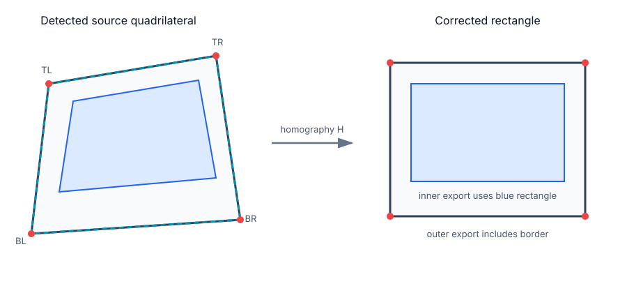

# Math and theory

This document explains the math behind the `instant_scan` pipeline.

It is written to be practical: enough theory to understand, debug, and improve the implementation.

## 1. Pixel model

The input image is an RGBA buffer. Each pixel has:

```text
R, G, B, A ∈ [0, 255]
```

The alpha channel is preserved during extraction, but the detector primarily uses RGB.

## 2. Brightness and chroma

To find the white instant-film border, the detector computes a luma-like brightness:

```text
Y = 0.299 R + 0.587 G + 0.114 B
```

In integer form the code uses an approximation:

```text
Y ≈ (77 R + 150 G + 29 B) / 256
```

This is close to standard luma weighting and is cheap in C.

A simple chroma measure is:

```text
C = max(R, G, B) - min(R, G, B)
```

White or off-white pixels tend to have:

```text
high Y
low C
```

So a conceptual white-border test is:

```text
Y ≥ threshold_brightness
C ≤ threshold_chroma
```

This is not meant to perfectly segment all white objects. It only needs to produce a useful candidate mask for the instant-film frame.

---

## 3. Binary masks

The white-border test produces a binary mask:

```text
M(x, y) ∈ {0, 1}
```

Where:

```text
M(x, y) = 1  means likely border pixel
M(x, y) = 0  means background, inner photo, text, or non-border
```

Many later operations work on this mask instead of the original color image.

---

## 4. Morphological closing

Text or dirt on the white border can break the mask into pieces.

The library uses morphological closing:

```text
close(M) = erode(dilate(M))
```

### Dilation

Dilation expands white regions:

```text
dilate(M)(x, y) = max M(i, j)
                  over neighbors around (x, y)
```

With a 3×3 structuring element:

```text
neighbors = {x-1..x+1, y-1..y+1}
```

### Erosion

Erosion shrinks white regions:

```text
erode(M)(x, y) = min M(i, j)
                 over neighbors around (x, y)
```

### Why closing helps

Closing fills small dark gaps:

```text
white border + dark handwriting gap
        ↓ closing
connected white border again
```

The final crop still uses the original RGBA pixels, so handwriting is not erased.

---

## 5. Connected components

A connected component is a maximal group of neighboring mask pixels where:

```text
M(x, y) = 1
```

The implementation uses 4-connectivity:

```text
left, right, up, down
```

For each component, the detector computes:

```text
area = number of pixels
bbox = [min_x, min_y, max_x, max_y]
bbox_width = max_x - min_x + 1
bbox_height = max_y - min_y + 1
fill_ratio = area / (bbox_width × bbox_height)
aspect = max(width, height) / min(width, height)
```

Components are filtered by size, aspect, and fill ratio.

A full solid rectangle would have fill ratio near 1.0. A white frame surrounding a darker inner photo has a lower fill ratio. This helps distinguish an instant-film border from a solid white object.

---

## 6. Exterior boundary

A frame component may contain internal holes:

```text
- inner photo area
- text on border
- scratches
- shadows
```

For line fitting, interior holes are harmful. The detector therefore estimates the exterior boundary.

Conceptually:

1. Treat the selected component as solid foreground.
2. Flood-fill the outside background from the image edges.
3. A component pixel is an exterior boundary pixel if it touches the outside-filled background.

```text
boundary pixel = component pixel adjacent to outside background
```

This makes the fitted outer frame robust to handwriting inside the border.

---

## 7. Lines

Each print side is modeled as a 2D line:

```text
a x + b y + c = 0
```

The line is normalized so:

```text
a² + b² = 1
```

Then the signed distance from a point `(x, y)` to the line is:

```text
d = a x + b y + c
```

and the absolute distance is:

```text
|d|
```

This is useful because fitting can minimize point-to-line distance.

---

## 8. Least-squares line fitting

Given boundary points:

```text
p_i = (x_i, y_i)
```

The goal is to find a line that minimizes squared perpendicular distance:

```text
minimize Σ (a x_i + b y_i + c)²
subject to a² + b² = 1
```

A practical way to solve this is:

1. Compute the centroid:

```text
x̄ = mean(x_i)
ȳ = mean(y_i)
```

2. Compute the covariance-like terms:

```text
Sxx = Σ (x_i - x̄)²
Syy = Σ (y_i - ȳ)²
Sxy = Σ (x_i - x̄)(y_i - ȳ)
```

3. The best-fit direction is the principal axis of the point cloud.
4. The line normal is perpendicular to that direction.
5. The line passes through the centroid.

For a long thin set of side-boundary pixels, this gives a stable side line.

---

## 9. Line intersections

Two lines:

```text
a1 x + b1 y + c1 = 0
a2 x + b2 y + c2 = 0
```

intersect where both equations are true.

Using determinants:

```text
det = a1 b2 - a2 b1
```

If:

```text
|det| ≈ 0
```

the lines are nearly parallel and the intersection is unstable.

Otherwise:

```text
x = (b1 c2 - b2 c1) / det
y = (c1 a2 - c2 a1) / det
```

The four corners are:

```text
top ∩ left     = TL
top ∩ right    = TR
bottom ∩ right = BR
bottom ∩ left  = BL
```

---

## 10. Homography / perspective transform




A phone photo of a flat print is a perspective projection of a plane.

Any quadrilateral on a plane can be mapped to a rectangle using a **homography**.

A homography is a 3×3 matrix:

```text
H = | h0 h1 h2 |
    | h3 h4 h5 |
    | h6 h7 h8 |
```

For a point in output/canonical coordinates:

```text
p = (x, y, 1)
```

the source-image point is:

```text
p' = H p
```

In Cartesian coordinates:

```text
u = (h0 x + h1 y + h2) / (h6 x + h7 y + h8)
v = (h3 x + h4 y + h5) / (h6 x + h7 y + h8)
```

The implementation solves for `H` using four point correspondences:

```text
canonical rectangle corners  →  detected source corners
```

A 3×3 homography has 9 values, but scale is arbitrary, so there are 8 degrees of freedom. Four point pairs provide 8 equations.

---

## 11. Perspective warp / resampling

To create a corrected output image, the extractor loops over each output pixel:

```text
for each output pixel (x, y):
    source = H(x, y)
    sample source image at source
```

The library uses **bilinear interpolation**.

If the mapped source coordinate is:

```text
(u, v)
```

and:

```text
x0 = floor(u)
x1 = x0 + 1
y0 = floor(v)
y1 = y0 + 1
```

then the pixel value is a weighted average of the four neighboring source pixels:

```text
P(u, v) =
  P00 (1 - tx)(1 - ty) +
  P10 tx      (1 - ty) +
  P01 (1 - tx) ty       +
  P11 tx      ty
```

where:

```text
tx = u - floor(u)
ty = v - floor(v)
```

This produces smoother results than nearest-neighbor sampling.

---

## 12. Film ratios

Each film format has known physical dimensions.

For simple ratio classification:

```text
ratio = max(width, height) / min(width, height)
```

The detector compares measured ratio to known film ratios:

```text
error = |measured_ratio - expected_ratio|
```

Confidence can be modeled as:

```text
confidence = 1 - error / max_allowed_error
```

clamped into:

```text
[0, 1]
```

This alone works well for clear, front-facing images, but perspective can distort apparent side lengths. That is why the current detector also uses template scoring.

---

## 13. Film templates and margins

Each known film type is described by:

```c
outer_width_mm
outer_height_mm
image_width_mm
image_height_mm
image_left_mm
image_top_mm
image_right_mm
image_bottom_mm
```

For a film template, the inner image rectangle in canonical film coordinates is:

```text
x0 = image_left_mm
y0 = image_top_mm
x1 = outer_width_mm  - image_right_mm
y1 = outer_height_mm - image_bottom_mm
```

This gives four inner corners:

```text
(x0, y0)
(x1, y0)
(x1, y1)
(x0, y1)
```

A homography maps those inner corners back into the source photo.

---

## 14. Template edge scoring

At the expected inner image boundary, the image should transition:

```text
white border → photo content
```

The detector samples pairs of points just outside and just inside the expected boundary.

For each boundary, it compares:

```text
outside_white_score - inside_white_score
```

A strong positive value means:

```text
outside looks like white border
inside looks less like white border
```

The four boundary scores are averaged:

```text
edge_score = mean(top, bottom, left, right)
```

The template also checks that expected border regions are mostly white:

```text
fill_score = mean(top_border, bottom_border, left_border, right_border)
```

The final template score is a weighted combination of:

```text
edge_score
fill_score
side_fill_score
bottom_border_bonus
```

The exact weights are implementation details and can be tuned with real fixtures.

---

## 15. Inner-window refinement

The film template gives a first estimate of the inner image window. The refinement step searches nearby positions:

```text
x0 ± small range
y0 ± small range
x1 ± small range
y1 ± small range
```

For each candidate rectangle, the detector scores:

```text
score =
  edge transition strength
+ white border outside the candidate
- penalty for moving far away from the template
```

The penalty is important. Without it, the search might lock onto a strong edge inside the photograph rather than the actual border/photo boundary.

A small final safety inset is applied to reduce leftover border in the exported inner photo.

---

## 16. Orientation normalization

Detection is geometric, so a sideways photo may produce a sideways crop.

For exports, the tool normalizes orientation by film family:

```text
Instax Wide       -> landscape
Instax Mini       -> portrait
Polaroid Classic  -> portrait
Polaroid Go       -> portrait
Instax Square     -> unchanged
```

For non-square prints, there are usually two rotations with the correct aspect. To decide which one is upright, the tool uses the bottom border.

Instant film usually has a larger bottom/chemical border. For each candidate rotation:

```text
bottom_score = white_fraction(bottom band)
top_score    = white_fraction(top band)
down_score   = bottom_score - top_score
```

The rotation with the highest `down_score` is chosen.

---

## 17. Why this works

The approach works because instant-film prints have strong physical constraints:

```text
flat rectangular object
known aspect ratios
known border margins
large white frame
inner photo window
larger bottom border
```

Even when the photo is skewed, perspective-distorted, or has handwriting on the border, those constraints give the detector enough structure to recover the print geometry.

---

## 18. Known limitations

The current method can still fail when:

- the background is also white and connected to the border
- the print is heavily occluded
- handwriting covers an entire edge
- the photo is very blurry
- strong glare makes the border or inner image indistinguishable
- the detected print is extremely perspective-distorted

Good next improvements would be:

```text
- stronger edge detector
- Hough/RANSAC line fitting
- confidence calibration using more real fixtures
- Android-facing rotation metadata
- optional user-controlled inner trim
```
